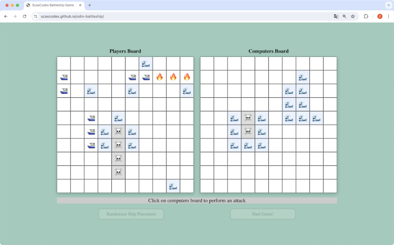

    

# Battleship Spiel

## Einführung

Dieses Projekt ist eine Implementierung des klassischen Schiffeversenken-Spiels mit HTML, CSS und JavaScript. Es wurde im Rahmen des JavaScript-Kurses von The Odin Project entwickelt.

## Projektbeschreibung

Das Battleship-Spiel bietet Spielern die Möglichkeit, ihre Flotten zufällig auf einem Gitter zu platzieren und dann abwechselnd Felder zu beschießen, um die Schiffe des Gegners zu versenken. Es beinhaltet sowohl einen menschlichen Spieler als auch einen Computergegner, der zufällige, aber gültige Züge macht.

## Funktionen

- **Schiff-Klasse:** Schiffe werden als Objekte erstellt, die ihre Länge, die Anzahl der Treffer und ihren Zustand (gesunken oder nicht) speichern.
- **Spielbrett-Klasse:** Spielbretter verwalten die Platzierung der Schiffe und verfolgen Treffer und Fehlversuche. Sie melden auch, ob alle Schiffe eines Spielers gesunken sind.
- **Spieler-Klasse:** Beinhaltet sowohl menschliche als auch Computer-Spieler, wobei Computer-Spieler zufällige Züge ausführen können.
- **Benutzeroberfläche:** Die Benutzeroberfläche ermöglicht es den Spielern, ihre Schiffe zufällig zu platzieren und Angriffe durchzuführen, wobei das Spielbrett nach jedem Zug aktualisiert wird.

## Installation

1. Klone das Repository: `git clone https://github.com/ScaxCodes/odin-battleship.git`
2. Navigiere in das Projektverzeichnis: `cd odin-battleship`
3. Öffne die `index.html` Datei in deinem Browser.

## Nutzung

- Drücke den Button "Randomize Ship Placement", um die Positionen deiner Schiffe zufällig zu ändern, bis sie dir gefallen.
- Nachdem die Schiffe platziert sind, drücke den "Start Game!" Knopf, um das Spiel zu beginnen.
- Klicke auf die Felder des gegnerischen Spielbretts, um Angriffe durchzuführen.
- Das Spiel endet, wenn alle Schiffe eines Spielers versenkt wurden.

## Herausforderungen und Lösungen

- Die Spielzüge des Computers wurden intelligenter gestaltet, indem er bei Treffern angrenzende Felder angreift.

## Verbesserungsmöglichkeiten

- Implementierung von Drag-and-Drop für die Platzierung der Schiffe.
- Einführung eines 2-Spieler-Modus, bei dem die Spieler das Gerät weiterreichen.
- Weitere Verbesserung der KI des Computergegners, sodass er bei Treffern noch systematischer angreift.
- Bessere Visualisierung bei einem Sieg, z.B. Konfetti-Regen oder andere Animationen.
- Einbau von Sound oder weiteren Animationen bei der Durchführung von Angriffen.
- Unterschiedliche Darstellung der Schiffe, je nach Größe.

## Lizenz

Dieses Projekt steht unter der MIT Lizenz.
